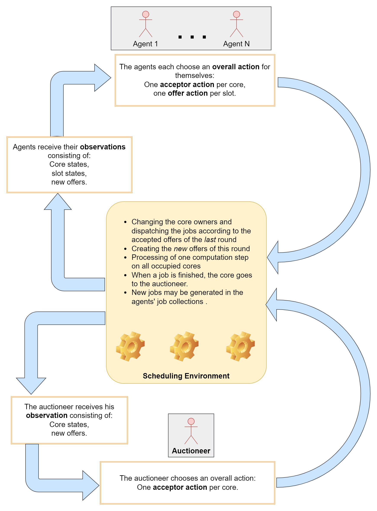

# Repository MARL Scheduling Environment

## Introduction

We implemented a scheduling environment for multiple RL agents. In this environment a common resource - computing cores - ought to be used efficiently by multiple agents who want to compute differently prioritized jobs on those cores. The trading mechanism allows the agents to enhance the individual rewards as well as the overall scheduling performance. In contrast to traditional, centralized scheduling concepts, the scheduling of this work is partially decentralized. The agents have the chance to exchange access to computing cores amongst each other if the current owner or user of a core accepts an explicit, observed offer directed at this core. This offer is a 2-tuple consisting of the reward payment and the necessary timesteps until payment. In scenarios with fixed prices, the reward payments are given as a hyperparameter associated with the job priority. In scenarios with free prices, the reward payment can be chosen by the offering agent.
No scheduling strategy is predefined; the scheduling results from the learned actions of the agents. An exception to this is the central, statically predetermined auctioneer, which manages currently idle cores and grants access to the highest bidding agent. The pure behavior of the auctioneer - without any intra-agent trading - implements a variant of first-come-first-serve (FCFS) where jobs with higher priority values are preferred. Figure \ref{fig: environment loop} gives an overview of the scheduling environment and the RL loop that the environment implements.

## Basic Hyperparameters

The scheduling environment simulates the allocation of computation time on a number of compute cores. `<em>`n`</em>` agents compete for the use of the `<em>`m`</em>` cores. Each of the agents has a job collection of length `<em>`k`</em>`. The state of an existing job is characterized by a positive integer priority `<em>`prio`</em>` and a positive integer (remaining) time `<em>`remaining time`</em>`. The maximum priority of a job as well as the maximum length of a job are set by `<em>`maxPrio`</em>` and `<em>`maxLen`</em>`. After processing `<em>`restzeit`</em>` time steps on an allocated core, the job pays out a reward that is exactly equal in amount to the priority `<em>`prio`</em>`. In addition to the agents, there is the auctioneer, which owns unallocated compute cores and grants access to any highest bidding agent. Agents can bid for any of their `<em>`k`</em>` job slots in each round to make a bid to the owner of a core. Offers are only visible and valid for one round. They consist of an integer price `<em>`price`</em>` from [0,`<em>`maxPrio`</em>`] and an integer time component `<em>`duration`</em>` from [1,`<em>`maxLen`</em>`]. `<em>`duration`</em>` specifies in how many time steps the payment is made. The owner of a core -i.e., an agent or the auctioneer- can accept one or none of the offers directed to that core in each round.The environment is turn-based. Episodes summarize a certain number of rounds, since RL algorithm training is built on episodic timing. The episode end is an ordinary round end with the special feature that agents are subsequently trained on it with their observed transitions of the ended episode. Apart from that, the episode end has no influence on what happens in the domain.

## Determinism

The environment changes its state deterministically for the most part: when bids are submitted and accepted, the resulting change in state is predetermined. The payment of RL rewards is also deterministic. However, if the auctioneer receives multiple offers with the same reward ratio, it accepts a random one of these offers. Leaving aside the actions of the other agents and the auctioneer, from an agent's point of view the only random element comes from the jobs moving up in his job collection. The moving-up job is drawn from a distribution specified in the parameters of the domain.

## Observations

The domain is only partially observable for the agents. Publicly visible are the states of the compute cores. Privatly visible are the slots of its own job collection as well as the offers addressed to it. The structure of the observations that the agents receive from the domain depend on the chosen structure of the agent. Nevertheless, the observation properties described here are ensured regardless of the agent structure.
The agents' observations include the current core states of all cores and their own slot states. A core or slot state consists of the state of the job (`<em>`prio`</em>`,`<em>`resttime`</em>`). In addition, each agent observes the offers directed to it as (`<em>`price`</em>`,`<em>`duration`</em>`), respectively. Agents can only perceive the provided offers of other agents via their observation of the environment - there is no other possibility. Core and slot allocations are modeled as empty if the allocation does not exist. The same is true for bids. Analogous to what is described, the auctioneer's observation consists of core states and offers directed to it. Unlike the agents, it does not observe slot allocations because it does not have any slots.

## Action Selection

Based on the observations, the auctioneer and the agents each select an overall action. An overall action consists of smaller sub-actions. Auctioneers and agents can accept one or no offers as a sub-action per core (the acceptor action). Of course, they can only accept offers to a core if they are currently in possession of the core - otherwise the offer would not have been delivered to them by observation.
In addition to acceptor actions, agents can make one or no offers to a core per slot in their own job collection. This offer consists of the familiar tuple (`<em>`price`</em>`,`<em>`duration`</em>`) for the observing counterparty; however, the offering party chooses the core and, depending on the setting, the price. With free choice of prices, it is also possible to specify a price equal to 0. This is to make it possible to compute on cores for free. The specified duration of the offer is in any case fixed by the real duration of the job. It cannot be falsified for an offer. To keep the complexity of the system low, it is possible for agents to make offers to cores they own themselves. There is no separate mechanism for exchanging own jobs on own cores.\\
The aggregate actions of the agents and the auctioneer, then consisting of several of these partial actions, are returned to the environment. By modeling that the total action consists of the described sub-actions, it is already implicitly ruled out that an agent can accept more than one bid for a possessed core or make more than one bid for an owned slot. The semantically incorrect multiple acceptance is thus already made impossible by the structure of the action. Multiple bidding per slot is also prevented by the structure of the plot.

## Step function

If the agents have selected actions based on the observations, the actions in the scheduling domain are processed by the step function and a successor state is generated: The environment will first execute the accepted offers. In each case, the old job is returned to its owner and the new job is allowed to compute on the core according to the accepted offer. This process is equivalent to dispatching in traditional scheduling. Also, the environment creates corresponding offers from the offer sub-actions of the agents. These offers will be included in the next observation of the receiving agent. After processing the offer and acceptor sub-actions, the environment will process one time unit of a job on each occupied core. When a job terminates, the respective core reverts to the ownership of the auctioneer. A new job is generated on a free slot to the owner of the terminated job. This job is drawn from a distribution specified by scenario-dependent domain parameters. Then, new observations for the agents and the auctioneer are generated again from this follow-up state of the environment.

## Rewards

In the scheduling environment, the rewarding scheme for the individual agents follows an egoistic principle. This is plausible in the context of independent learners that want to get their jobs computed or receive traded rewards.

### Reward for terminating jobs and trading access

The responsible owner of a core - i.e. the agent currently running a job on it - gets a reward as soon as its own job has terminated. This reward has the same value as the priority of the job. The owner of a core can receive a reward in yet another way: through a trade. If an offer is accepted, its promised reward payment is first stored by the environment in a chronological order with respect to a core as long as no job has been finished yet. When a job terminates all stored reward claims and liabilities of the preceding trades are settled and each participant in the reward chain receives its net payout. This reward chains initially start with the auctioneer as the owner of all cores and bring no additional net rewards into the system when a job terminates. They are only a redistribution of the generated reward.

### Reward for offers

The offer side, on the other hand, receives its rewards directly in the next time step if its offer has successfully been accepted by the counterparty. The generated reward is equal to the priority of the mediated job.

### Reward for free price selection

In the free price scenarios, the agents will be enabled to freely set prices for their offers. The rewarding scheme of the price setting action can be motivated by a commercial and a non-commercial motive. In the former case the agent wants to bid an amount as small as possible that is just on the brink of being accepted. Mainly, the paid out reward is the difference between the job priority of the facilitated job $p_i$ and the chosen price $x$ which can also be negative if the price is set too high (cf. eq. $R_{1}$).

``

In the non-commercial case, the reward equals the priority of the the facilitated job $p_i$ as long as the set price $x$ was not higher than the job priority (cf. eq. $R_{2}$). In this case the price setter can increase the bids for free as long as it does not overshoot.

``

## Used code templates

The implementation of the reinforcement learning algorithms was based on freely available code templates, which should not go unmentioned: The implementation of the PPO algorithm was originally taken from [PPO](https://github.com/nikhilbarhate99/PPO-PyTorch "PPO-Pytorch implementation") and adapted to the requirements of the project. The implementation of the [DQN](https://github.com/pytorch/tutorials/blob/master/intermediate\_source/reinforcement\_q\_learning.py "DQN-Pytorch implementation") algorithm was also based on a public repository template and adapted to the project.

## Explanation of hyperparameters

| Parameter               | Default | Description                                                                                                                                                                                                                                                                                                        |
| ----------------------- | ------- | ------------------------------------------------------------------------------------------------------------------------------------------------------------------------------------------------------------------------------------------------------------------------------------------------------------------ |
| num\_episodes           | 1234    | specifies the number of episodes                                                                                                                                                                                                                                                                                   |
| episodeLength           | 1234    | specifies the episode length in time increments                                                                                                                                                                                                                                                                    |
| newJobsPerRoundPerAgent |         | specifies how many new jobs will be generated in an agent's job collection at the beginning of a time step, provided that there is free space in the collection, taking into account any currently running jobs that still need to be deferred. Jobs are thus replenished when the job collection cannot overflow. |
| possibleJobPriorities   |         |                                                                                                                                                                                                                                                                                                                    |
| possibleJobLengths      |         |                                                                                                                                                                                                                                                                                                                    |
| fixPricesList           |         |                                                                                                                                                                                                                                                                                                                    |
| probabilities           |         |                                                                                                                                                                                                                                                                                                                    |

`<em>`LR\_ACTOR `</em>` and `<em>`LR\_CRITIC `</em>` indicate the initial learning rate of the actor and critic networks of acceptor and offer networks, respectively.` `
`<em>`ACCEPTOR\_GAMMA `</em>` and `<em>`OFFER\_GAMMA `</em>` indicate the gamma, the discount factor of future rewards, for the acceptor and offer unit, respectively.\ `<em>`ACCEPTOR\_GAMMA `</em>` is also the discount factor for the fully aggregated unit. `<em>`ACCEPTOR\_GAMMA `</em>` is usually higher than `<em>`OFFER\_GAMMA `</em>` because the time horizon to be considered is usually higher for acceptor trades than for offer trades. This stems from the fact that the acceptor side receives its rewards only at the completion of a job on the core, while the offer side receives its rewards immediately at the next time step.` `
`<em>`ACCEPTOR\_K\_EPOCHS `</em>` and `<em>`OFFER\_K\_EPOCHS `</em>` indicate the number of iterations with which the acceptor and offer units' memories are used to optimize their neural networks, respectively. The price setter modules also use `<em>`OFFER\_K\_EPOCHS `</em>`.` `
`<em>`NUM\_NEURONS `</em>` specifies the number of neurons of a distributed, semi-aggregated acceptor or offer unit or a fully aggregated unit.` `
`<em>`CENTRALISATION\_SAMPLE `</em>` specifies, for parameter sharing, how many randomly selected subunit memories are included for a training run.` `
`<em>`EPS\_CLIP `</em>` specifies the value of the clipping parameter needed for PPO.` `
`<em>`UPDATE\_STEP `</em>` specifies after how many time steps the neural networks are trained with the transitions experienced during this period.
